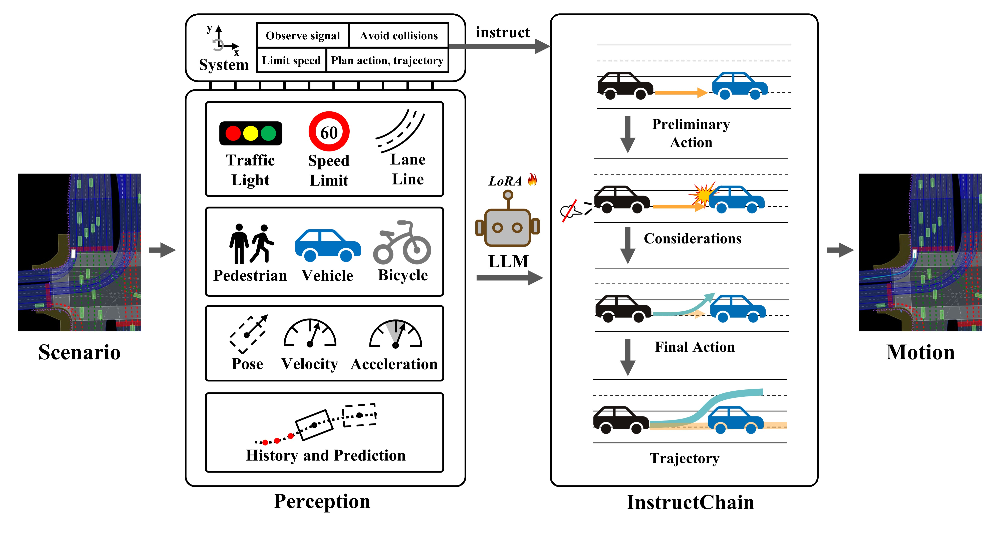
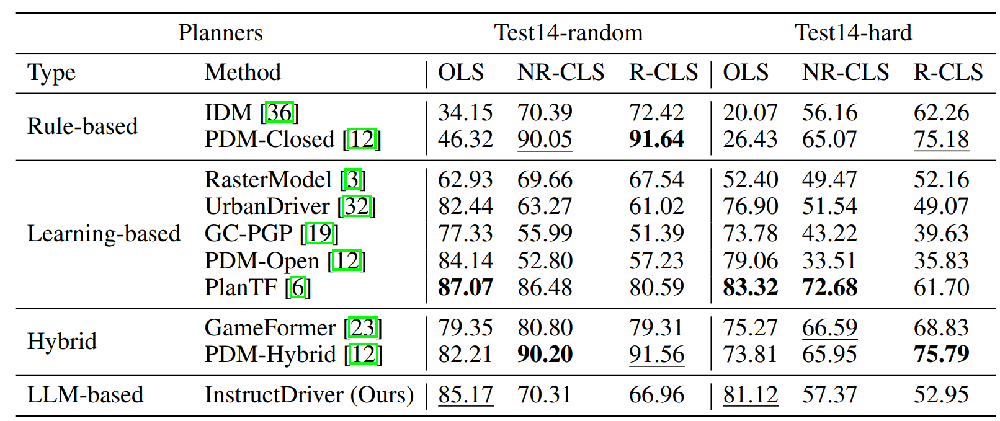

# Instruct Large Language Models to Drive like Humans


This is the official repository of [**Instruct Large Language Models to Drive like Humans**](http://arxiv.org/abs/2406.07296).


## Overview



Our approach transforms scenario data into textual descriptions and, by setting specific instructions, enables a fine-tuned LLM to generate InstructChain and trajectories that align with human driving behavior. The trajectory is subsequently applied in a simulated environment.


## Results




## Getting Started

### Dataset Setup

Follow the [official documentation](https://nuplan-devkit.readthedocs.io/en/latest/dataset_setup.html) to set up the nuPlan dataset.


### Setup Environment

- Create an environment using Python 3.10

```sh
conda create -n instruct_driver python=3.10
source activate instruct_driver
```

- Follow the [official documentation](https://llama2-accessory.readthedocs.io/en/latest/install.html) to set up the LLaMA2-Accessory environment.
- Follow the [official documentation](https://nuplan-devkit.readthedocs.io/en/latest/installation.html) to set up the nuplan-devkit environment. Make sure to set the following variables correctly:

```
- NUPLAN_DATA_ROOT
- NUPLAN_MAPS
- NUPLAN_EXP_ROOT
```

- Clone the `instruct_driver` repository:

```shell
cd nuplan-devkit
git clone https://github.com/bonbon-rj/InstructDriver.git
```


After setting up the environment, your directory structure should appear as follows:

```
├── LLaMA2-Accessory
├── nuplan-devkit
│  ├── instruct_driver
```


### Feature cache

This section preprocesses the dataset to enable faster subsequent data retrieval.

This refers to the implementation of [planTF](https://github.com/jchengai/planTF).

Execute the command below to generate 1M frames of training data in `cache.cache_path`. 

You may need to:

- Modify `cache.cache_path` according to your setup.
- Adjust `worker.threads_per_node` based on your RAM and CPU capacity.

Please note that this step is time-intensive and may take dozens of hours to complete.

```shell
export PYTHONPATH=$(pwd)/nuplan-devkit:$PYTHONPATH
export PYTHONPATH=$(pwd)/nuplan-devkit/instruct_driver:$PYTHONPATH

cd ./nuplan-devkit/instruct_driver
python run_cache.py \
+caching=cache_llm \
scenario_builder=nuplan \
cache.cache_path=/path/to/cache_1M \
cache.cleanup_cache=true \
scenario_filter=training_scenarios_1M \
worker.threads_per_node=40
```


### Get training data from cache

This section of the code transforms cached data into a json file formatted for training LLM.

Use the command below to process `limit_num` cache entries (modifiable in the code). 

It converts these entries into a json file and saves it at `/path/to/cache_1M/training_json/train.json`:

```shell
cd ./nuplan-devkit/instruct_driver
python cache2json.py \
+caching=cache_llm \
cache.cache_path=/path/to/cache_1M
```


### Training

Following the steps outlined above, you will obtain the `train.json` file suitable for training LLM. 

For guidance on fine-tuning the model, please consult the [official documentation](https://llama2-accessory.readthedocs.io/en/latest/finetune/sg_peft.html#bias-norm-lora-tuning-of-llama2-7b-on-alpaca).


### Evaluation

After training, populate the following parameters in the `llm_patches/llm_singleton.py` file:

```python
llama_config=''
lora_config=''
tokenizer_path=''
pretrained_path=''
```

Then, execute the command below to initiate the simulation. You can run various types of simulations by modifying the `simulation_type` parameter:

```shell
export PYTHONPATH=$(pwd)/nuplan-devkit:$PYTHONPATH
export PYTHONPATH=$(pwd)/nuplan-devkit/instruct_driver:$PYTHONPATH
export PYTHONPATH=$(pwd)/LLaMA2-Accessory:$PYTHONPATH
cd ./nuplan-devkit/instruct_driver
simulation_type=open_loop_boxes # closed_loop_nonreactive_agents closed_loop_reactive_agents
sh ./script/benchmarks_test14-hard.sh $simulation_type
```


## Acknowledgement

[nuplan-devkit](https://github.com/motional/nuplan-devkit)   [LLaMA2-Accessory](https://github.com/Alpha-VLLM/LLaMA2-Accessory)   [planTF](https://github.com/jchengai/planTF)


## Citation

```
@misc{zhang2024instruct,
      title={Instruct Large Language Models to Drive like Humans}, 
      author={Ruijun Zhang and Xianda Guo and Wenzhao Zheng and Chenming Zhang and Kurt Keutzer and Long Chen},
      year={2024},
      eprint={2406.07296},
      archivePrefix={arXiv},
      primaryClass={cs.RO}
}
```

**Note:** This code is only used for academic purposes, people cannot use this code for anything that might be considered commercial use.